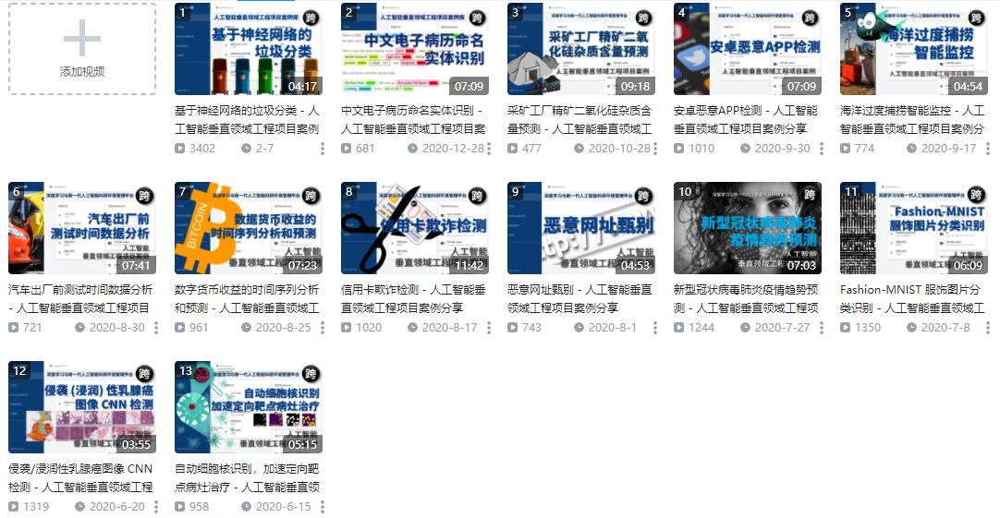

# 人工智能垂直领域工程项目案例库
为响应《[国家新一代人工智能标准体系建设指南](http://www.gov.cn/zhengce/zhengceku/2020-08/09/content_5533454.htm)》号召，跨象乘云™ 为高校人工智能专业实验室提供面向多个垂直行业的海量实战项目案例库，360° 全方位覆盖数据科学、机器学习、深度学习与新一代人工智能技术在医疗、金融、制造/工业 4.0、信息安全、环保、商务等多个行业内各方面应用、业务逻辑与相关数学分析模型及数据集。通过面向垂直行业的海量案例聚焦实战，以及完整的『端到端』业务流程演示与上机操作训练，让学生获取跨学科，跨专业知识认知并真正了解如何将数据科学、机器学习、深度学习、人工智能技术与产业应用的业务背景结合在一起，以及了解企业实施技术需求。通过直观而具备针对性的实践训练，使学生在短时间内得到应用技术技能的提升，更进一步满足职业岗位对工作技能的需求。

- **工程构思：** 定义业务目标、数据源、团队和战略规划，并启动项目
- **训练数据：** 了解如何收集、分析、预处理和注释数据
- **智能技术：** 选择符合项目需求的人工智能开发框架，合理量化并定义运算资源需求
- **训练模型：** 设置基础设施，选择模型，训练模型并将模型迭代至目标性能指标
- **部署应用：** 选择符合业务需求的模型部署方式，如：嵌入式边缘计算、分布式、RestFul API 服务接口投入生产。

## 精选项目案例演示视频频道（持续更新中...）：
https://space.bilibili.com/189064479/channel/detail?cid=142005

## 1. 基于神经网络的垃圾分类（智能环保领域）
**项目概述：** 垃圾分类（Garbage Classification），指按一定规定或标准将垃圾分类储存、投放和搬运，转变成公共资源的一系列活动。提高垃圾资源价值，减少垃圾处理量，降低处理成本，减少土地消耗，具有社会、经济、生态等多方面的效益。然而让大部分人正确区分垃圾类别并不容易。本案例使用 2,000 张以上的生活垃圾图片，基于 TensorFlow 搭建深度学习模型，建立 CNN 卷积神经网络实现智能垃圾分类。
- [案例说明](./%E6%99%BA%E8%83%BD%E7%8E%AF%E4%BF%9D/%E5%9F%BA%E4%BA%8E%E7%A5%9E%E7%BB%8F%E7%BD%91%E7%BB%9C%E7%9A%84%E5%9E%83%E5%9C%BE%E5%88%86%E7%B1%BB/README.md)
- [案例演示视频](https://www.bilibili.com/video/BV16y4y1n7rK)
- [案例代码 Notebook](./%E6%99%BA%E8%83%BD%E7%8E%AF%E4%BF%9D/%E5%9F%BA%E4%BA%8E%E7%A5%9E%E7%BB%8F%E7%BD%91%E7%BB%9C%E7%9A%84%E5%9E%83%E5%9C%BE%E5%88%86%E7%B1%BB/%E5%9F%BA%E4%BA%8E%E7%A5%9E%E7%BB%8F%E7%BD%91%E7%BB%9C%E7%9A%84%E5%9E%83%E5%9C%BE%E5%88%86%E7%B1%BB.ipynb)

本案例适合作为深度学习实践课程配套教学案例，能够达到以下教学效果：

- **提升学生数据预处理能力：** 通过对样本图片进行缩放、翻转、选择等操作对样本进行扩充，使得样本数据更加丰富，有利于模型性能的提高。
- **提升学生深度学习建模的能力：** 提升学生通过 Tensorflow 框架建立深度神经网络模型的能力，通过相对直观的 Keras 序贯模型建立垃圾分类的卷积神经网络模型，并进行编译和训练。
- **帮助学生掌握模型评估常用手段：** 通过数据绘图，实现模型评估常用指标：准确率和损失值的可视化评估。
- **帮助学生掌握模型测试与推理方法：** 通过对完成训练后的模型进行部署与加载，使用训练/测试集以外的第三方图片进行推理验证。

原创制作：[广州跨象乘云软件技术有限公司](https://www.080910t.com/)（版权所有，不得转载）
