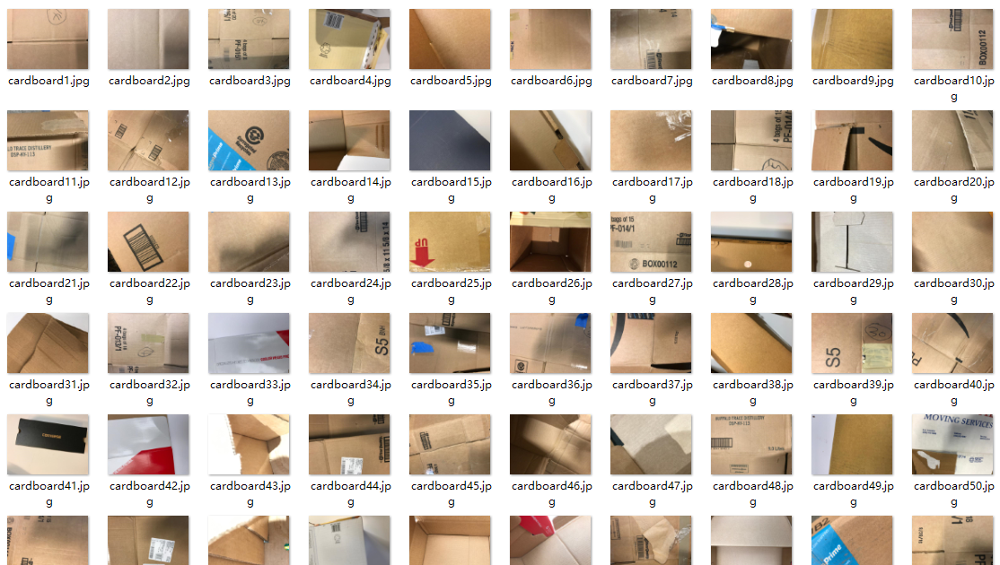
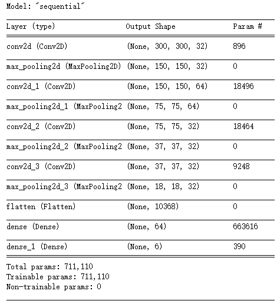
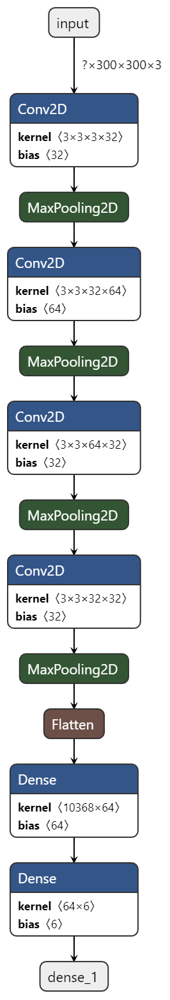
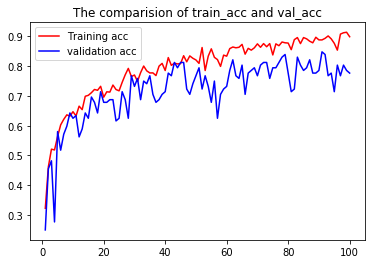
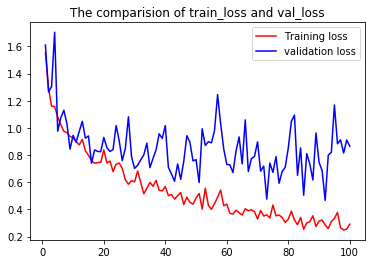

# 智能环保项目案例：基于神经网络的垃圾分类


垃圾分类，一般是指按一定规定或标准将垃圾分类储存、分类投放和分类搬运，从而转变成公共资源的一系列活动的总称。分类的目的是提高垃圾的资源价值和经济价值，力争物尽其用。垃圾分为四类，分别是：有害垃圾、厨余垃圾、可回收物和其他垃圾，其对应的垃圾桶颜色分别是红、绿、蓝、黑。

本次项目使用的数据集包括硬纸板、玻璃制品、金属、纸制品、塑料和废物垃圾等 6 种常见的生活垃圾共计 `2,247` 张。项目分为三部分。数据处理、模型建立和模型测试。经过迭代模型在训练集上准确率达到 `89.89%` 左右，在验证集上准确率达到 `77.68%` 左右。



本案例适合作为深度学习实践课程配套教学案例，能够达到以下教学效果：

- **提升学生数据预处理能力：** 通过对样本图片进行缩放、翻转、选择等操作对样本进行扩充，使得样本数据更加丰富，有利于模型性能的提高。
- **提升学生深度学习建模的能力：** 提升学生通过 TensorFlow 框架建立深度神经网络模型的能力，通过相对直观的 tf.keras 序贯模型建立垃圾分类的卷积神经网络模型，并进行编译和训练。。
- **帮助学生掌握模型评估常用手段：** 通过数据绘图，实现模型评估常用指标：准确率和损失值的可视化评估。
- **帮助学生掌握模型测试与推理方法：** 通过对完成训练后的模型进行部署与加载，使用训练/测试集以外的第三方图片进行推理验证。

作为第一个分享案例，我们并不大打算从一开始就聚焦于编码细节或者数学公式，而是希望通过本案例，介绍相关技术的背景知识以及基本原理。

## 案例依赖库
本案例主要采用 tf.keras 进行 TensorFlow 深度神经网络模型构建。Keras 最初是由 Google AI 开发人员/研究人员 Francois Chollet 创建并开发的。Francois 于 2015 年 3 月 27 日将 Keras 的第一个版本 commit 并 release 到他的 [GitHub](https://github.com/fchollet)。一开始，Francois 开发 Keras 是为了方便他自己的研究和实验。但是，随着深度学习的普及，许多开发人员、程序员和机器学习从业人员都因其易于使用的 API 而涌向 Keras。

同时，为了训练自己自定义的神经网络，Keras 需要一个后端。后端是一个计算引擎——它可以构建网络的图和拓扑结构，运行优化器，并执行具体的数字运算。要理解后端的概念，可以试想你需要从头开始构建一个网站。你可以使用 PHP 编程语言和 SQL 数据库。这个 SQL 数据库就是是后端。你可以使用 MySQL，PostgreSQL 或者 SQL Server 作为你的数据库；但是，用于与数据库交互的 PHP 代码是不会变的。PHP 并不关心正在使用哪个数据库，只要它符合 PHP 的规则即可。Keras 也是如此。你可以把后台看作是你的数据库，Keras 是你用来访问数据库的编程语言。你可以把后端替换成任何你喜欢的后端，只要它遵守某些规则，你的代码就不需要更改。因此，你可以把 Keras 看作是一组用来简化深度学习操作的封装（Abstraction）。在 v1.1.0 之前，Keras 的默认后端都是 Theano。与此同时，Google 发布了 TensorFlow，这是一个用于机器学习和神经网络训练的符号数学库。Keras 开始支持 TensorFlow 作为后端。渐渐地，TensorFlow 成为最受欢迎的后端，这也就使得 TensorFlow 从 Keras v1.1.0 发行版开始成为 Keras 的默认后端。


当谷歌在 2019 年 6 月发布 TensorFlow 2.0 时，他们宣布 Keras 现在是 TensorFlow 的官方高阶 API，用于快速简单的模型设计和训练。另一方面，随着 Keras 2.3.0 的发布，[Francois 声明](https://github.com/keras-team/keras/releases/tag/2.3.0)：

- 这是 Keras 首个与 tf.keras 同步的版本
- 这也是 Keras 支持多个后端（即 Theano，CNTK 等）的最终版本
- 最重要的是，所有深度学习从业人员都应将其代码转换成 TensorFlow 2.0 和 tf.keras 软件包
- 原始的 keras 软件包仍会接收 bug 并修复，但请向前看，你应该开始使用 tf.keras 了

因此，在本案例中，我们直接使用 tf.keras 进行 TensorFlow 神经网络的构造：

```python
from tensorflow.keras.preprocessing.image import ImageDataGenerator, load_img, img_to_array, array_to_img
from tensorflow.keras.layers import Conv2D, Flatten, MaxPooling2D, Dense
from tensorflow.keras.models import Sequential
from tensorflow.keras.callbacks import EarlyStopping
from tensorflow.keras.applications.imagenet_utils import preprocess_input
from tensorflow.keras.models import model_from_json
from tensorflow.keras.preprocessing import image
from tensorflow.keras.optimizers import SGD
```
## 1. 数据处理与数据扩充
本案例中，我们采用了一份样本非常小的数据集进行垃圾图像分类模型的训练，要获得几百或几千张属于你所感兴趣的类别的训练图像往往不是一件容易的事情。在很多实际使用的情况下，即使是小规模的数据集合也可能是非常昂贵的，有时近乎无法获得（例如：在医学图像领域）。能够最大限度利用非常少的数据是一个称职的数据科学家的关键技能。在 2014 年左右，Kaggle 开始了猫狗识别的对决（总共用了 25,000 张训练图像），出现了以下声明：

> 在许多年前进行的一项非正式调查中，计算机视觉专家假定，在现有技术状态没有出现大进步的情况下，超过 60% 准确性的分类器将是一个难题。作为参考，一个 60% 的分类器将一个 12 张图像的 HIP 的猜测概率从 1/4096 提高到 1/459。当前文献表明，在这项任务上，机器分类器可以取得高于 80% 的准确性。[原文](http://xenon.stanford.edu/~pgolle/papers/dogcat.pdf)

因此，有一种流传的说法是：**只有当你有一个庞大的数据量时，深度学习才有意义**。

虽然这不是完全不正确，它有点误导。当然，深度学习需要自动从数据学习特性的能力，这通常只有当大量的训练数据可用时才有可能，特别是对于那些输入样本非常高维度的问题，例如：图像。然而，卷积神经网络深度学习，在设计上是可用于大多数『感知』问题（如：图像分类）的最好的模型之一，甚至用很少的数据来学习。在一个小的图像数据集从头开始训练卷积神经网络仍然会产生合理的结果，而无需任何自定义特征的工程。更重要的是，深度学习模型本质上是高度多用途的：你可以采取，比如说，在大型数据集上训练的图像分类或语音到文本模型，然后在只有轻微的变化的问题上重用它，很多预先训练模型（通常在 ImageNet 数据集上训练），现在可以公开下载，并且可以用用很少的数据来引导强大的视觉模型。

我们在这里使用的数据扩充，就是其中一种最常用的解决小规模数据集进行深度学习的方法。为了充分利用我们的一些训练例子，我们将通过一系列的随机变换『增强』它们，从而让我们的模型绝不会两次看到完全相同的图像，这有助于防止过度拟合并帮助模型归一化。我们使用了 `ImageDataGenerator` 类，通过实时数据增强生成张量图像数据批次。 `ImageDataGenerator` 类包含了许多图片预处理参数，例如：`rescale` 可以实现图片像素归一化。同时，为了防止模型过拟合，可以采取一些数据增强（Data augmentation）操作：水平翻转、垂直旋转等。

```python
train_datagen = ImageDataGenerator(
    rescale=1. / 255,                # 数据缩放，把像素点的值除以255，使之在0到1之间
    shear_range=0.1,                 # 错切变换角度
    zoom_range=0.1,                  # 随机缩放范围
    width_shift_range = 0.1,         # 随机垂直或水平平移图片的范围（作为总宽度或总高度的一部分）
    height_shift_range = 0.1,
    horizontal_flip=True,            # 随机水平翻转
    vertical_flip = True,            # 随机垂直翻转
    validation_split = 0.1           # 保留供验证集使用的图像
)
```
完整的参数说明可以查阅 Keras 的[文档](https://keras.io/zh/preprocessing/image/#imagedatagenerator)。

以下为采用数据扩充策略后的效果图 ——


## 2. 构建 sequential 模型
keras 中的主要数据结构是 model（模型），它提供定义完整计算图的方法。通过将图层添加到现有模型/计算图，我们可以构建出复杂的神经网络。Keras 有两种不同的构建模型的方法：

1. Sequential models（Sequential 顺序/序贯模型）
2. Functional API（使用函数式 API 的 Model 类模型）

除了这两类模型之外，你还可以通过继承 `Model` 类并在 `call` 方法中实现你自己的前向传播，以创建你自己的完全定制化的模型，这里我们不讨论。Sequential 模型字面上的翻译是顺序模型，给人的第一感觉是那种简单的线性模型，但实际上 Sequential 模型可以构建非常复杂的神经网络，包括全连接神经网络、卷积神经网络(CNN)、循环神经网络(RNN)、等等。这里的 Sequential 更准确的应该理解为堆叠，通过堆叠许多层，构建出深度神经网络。Sequential 模型的核心操作是添加 layers（图层）。本案例中，我们还将一些流行的图层添加到模型中：

### 2.1 添加卷积层（输入层）
从我们所学习到的机器学习知识可以知道，机器学习通常包括定义模型、定义优化目标、输入数据、训练模型，最后通常还需要使用测试数据评估模型的性能。keras 中的 Sequential 模型构建也包含这些步骤。首先，网络的第一层是输入层，读取训练数据。为此，我们需要指定为网络提供的训练数据的大小，这里 `input_shape` 参数用于指定输入数据的形状：
```python
model.add(Conv2D(filters=32, kernel_size=3, padding='same', activation='relu', input_shape=(300, 300, 3)))
```
上面的代码中，输入层是卷积神经网络使用最常见的二维卷积层，它有高和宽两个空间维度，常用来处理图像数据。其获取 `300 ，300，3` 的输入图像 —— `300` x `300` RGB `3` 通道。

### 2.2 添加最大池化层
```python
model.add(MaxPooling2D(pool_size=2))
```
池化过程在一般卷积过程后。池化（pooling） 的本质，其实就是采样。Pooling 对于输入的 Feature Map，选择某种方式对其进行降维压缩，以加快运算速度。上面的代码中，我们采用应用较多的一种池化过程叫最大池化（Max Pooling）。

### 2.3 添加展平层（Flatten）
```python
model.add(Flatten())
```
展平层用于输入层或者卷积层和全连接层中间，其目的在于将数据展平为适合神经网络的结构。

### 2.4 添加全连接层
```python
model.add(Dense(64, activation='relu'))
```
全连接层在整个网络卷积神经网络中起到『分类器』的作用，把特征整合到一起，交给最后的分类器或者回归。

### 2.5 输出模型各层参数
最后，通过 `model.summary()` 输出模型概述信息，其中最重要的信息是模型各层的参数状况，在本案例中，我们的模型共有 `711,110` 个参数。
```python
model.summary()
```


如果你对如何计算各层参数感兴趣，可以参考[这个帖子](https://stackoverflow.com/questions/44608552/keras-cnn-model-parameters-calculation)，同时，关于 sequential 模型完整的模型说明可以查阅 Keras 的[文档](https://keras.io/zh/getting-started/sequential-model-guide/)。

### 2.6 模型结构
由下图可以看出，最后我们得到了一个：二维卷积（输入）-> 最大池化 -> 二维卷积 -> 最大池化 -> 二维卷积 -> 最大池化 -> 二维卷积 -> 最大池化 - 展平 -> 全连接 -> 全连接（输出）的深度神经网络结构。之后对其进行编译、训练与评估。[点击查看原图](./img/model.h5.png)



### 2.7 编译与训练网络

编译模型需要定义两个参数：损失函数和优化器。

本案例采用多分类损失函数 `categorical_crossentropy` 以及自适应矩估计（`adam`）优化器。

```python
model.compile(loss='categorical_crossentropy',      # 应用 categorical_crossentropy 损失函数
                    optimizer='adam',#sgd 'adam'    # 应用 Adam 优化器
                    metrics=['accuracy'])           # 应用 Accuracy 评估函数，评估当前训练模型的性能
```

- 损失函数/代价函数是机器学习、统计学、概率学等涉及到数理知识的研究中的基础概念，具体来说，损失函数计算单个训练样本的误差，代价函数是整个训练集的损失函数的平均。但一般来说对两者不做过多区分。`categorical_crossentropy` 损失函数一般用于多分类问题，与本案例垃圾分类的场景符合。除了 `categorical_crossentropy` 损失函数，你还可以使用更多的优化器，详情可查阅 [Keras 文档](https://keras.io/zh/losses/)。

- 优化器是提供了一个可以使用各种优化算法的接口，可以让用户直接调用一些经典的优化算法，令模型求出最优解。`Adam` 算法，即一种对随机目标函数执行一阶梯度优化的算法，该算法基于适应性低阶矩估计。除了 `Adam` 优化器，你还可以使用更多的优化器，详情可查阅 [Keras 文档](https://keras.io/zh/optimizers/)。

之后，便可以对网络进行训练：

```python
history_fit = model.fit_generator(train_generator,
                                  epochs=100,                       # 迭代总轮数
                                  steps_per_epoch=2276//32,         # generator 产生的总步数（批次样本）
                                  validation_data=val_generator,    # 验证数据的生成器
                                  validation_steps=251//32)
```

### 2.8 可视化准确率和损失值

我们在使用 `model.fit()` 函数进行训练时，同步记录了训练集和测试集的损失和准确率，并且将历史记录另存为字典，以备日后绘制损失或准确率时使用。

```python
with open(root_path + "/history_fit.json", "w") as json_file:
    json_file.write(str(history_fit))
```

进行准确率和损失值的可视化，就是将 `acc` 和 `loss` 使用 matplotlib Python 库画出来。

```python
# 使用 history 将训练集和测试集的 acc 和 loss 调出来
acc = history_fit.history['accuracy']                # 训练集准确率
val_acc = history_fit.history['val_accuracy']        # 测试集准确率
loss = history_fit.history['loss']                   # 训练集损失值
val_loss = history_fit.history['val_loss']           # 测试集损失值
```

分别对训练集与测试集的准确率对比、以及训练集与与测试集的损失值对比进行画图 ——

```python
epochs = range(1, len(acc) + 1) 
plt.figure("acc")
plt.plot(epochs, acc, 'r-', label='Training acc')
plt.plot(epochs, val_acc, 'b', label='validation acc')
plt.title('The comparision of train_acc and val_acc')
plt.legend()
plt.show()

plt.figure("loss")
plt.plot(epochs, loss, 'r-', label='Training loss')
plt.plot(epochs, val_loss, 'b', label='validation loss')
plt.title('The comparision of train_loss and val_loss')
plt.legend()
plt.show()
```

得到模型训练过程中，训练集与测试集准确率与损失值的可视化数据。



## 3. 模型测试

### 3.1 保存模型
模型测试前，首先要保存并重加载模型。本案例同时演示了几种常见的深度神经网络模型的保存方法。首先，你需要了解 Keras 模型由多个组件组成：
- 架构或配置，它指定模型包含的层及其连接方式
- 一组权重值（即：模型的状态）
- 优化器（通过编译模型来定义）
- 一组损失和指标（通过编译模型或通过调用 `add_loss()` 或 `add_metric()` 来定义）

可以通过 Keras API 将这些组件一次性保存到磁盘，或仅选择性地保存其中一些组件：
- **仅保存架构/配置。通常保存为 JSON 文件。** 

```python
model_json=model.to_json()
with open(root_path+'/model_json.json', "w") as json_file:
    json_file.write(model_json)
```

- **仅保存权重值。通常在训练模型时使用。**

```python
model.save_weights(root_path+'/model_weight.h5')
```

- **将所有内容以 TensorFlow SavedModel 格式（或较早的 Keras H5 格式）保存到单个归档。这是标准做法。**

```python
model.save(root_path+'/model.h5')
```
### 3.2 加载模型


原创制作：[广州跨象乘云软件技术有限公司](https://www.080910t.com/)（版权所有，不得转载）
